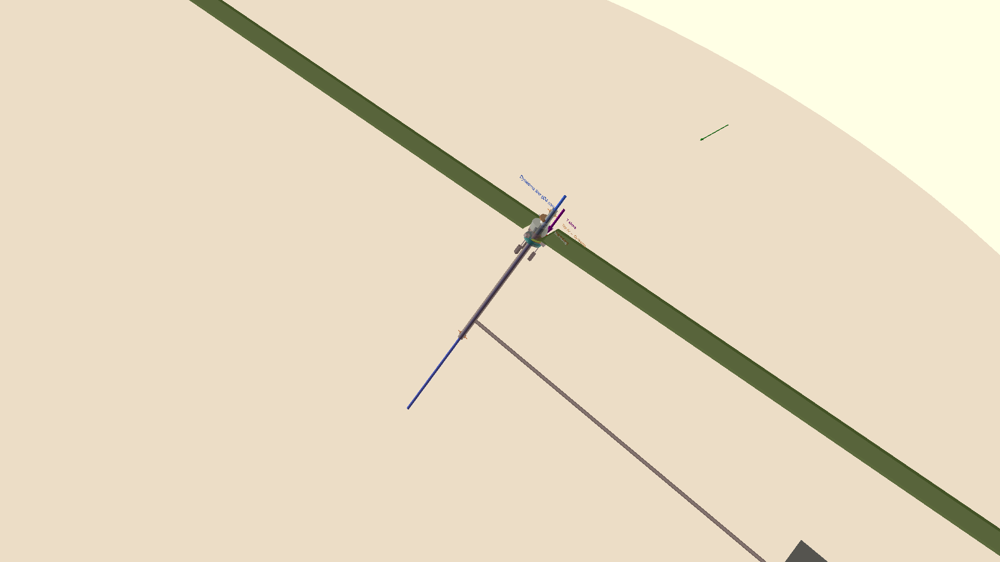
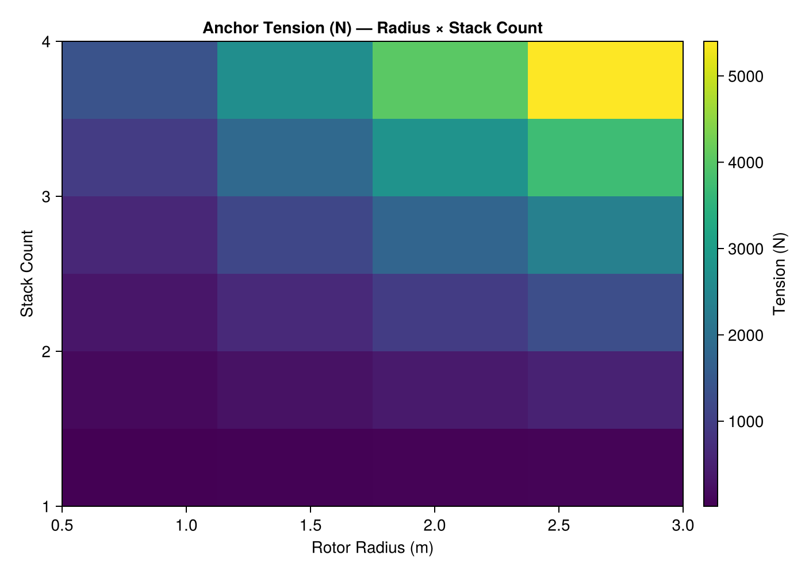
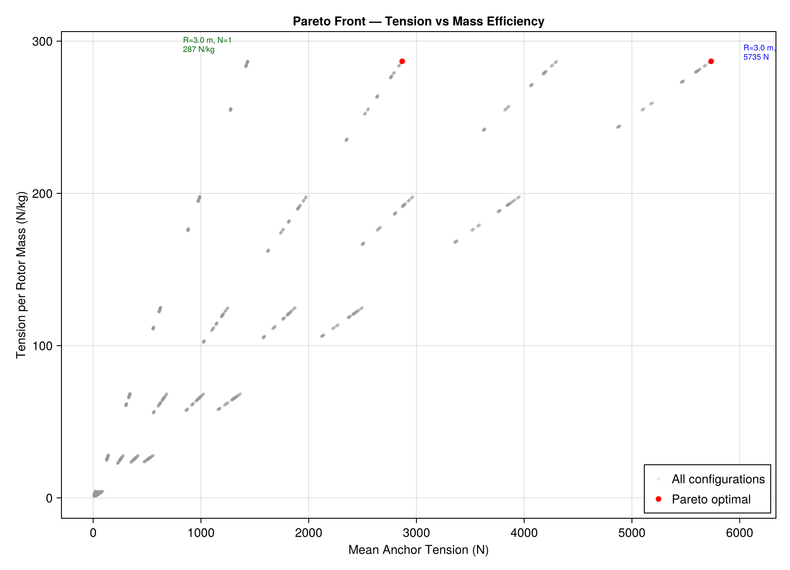
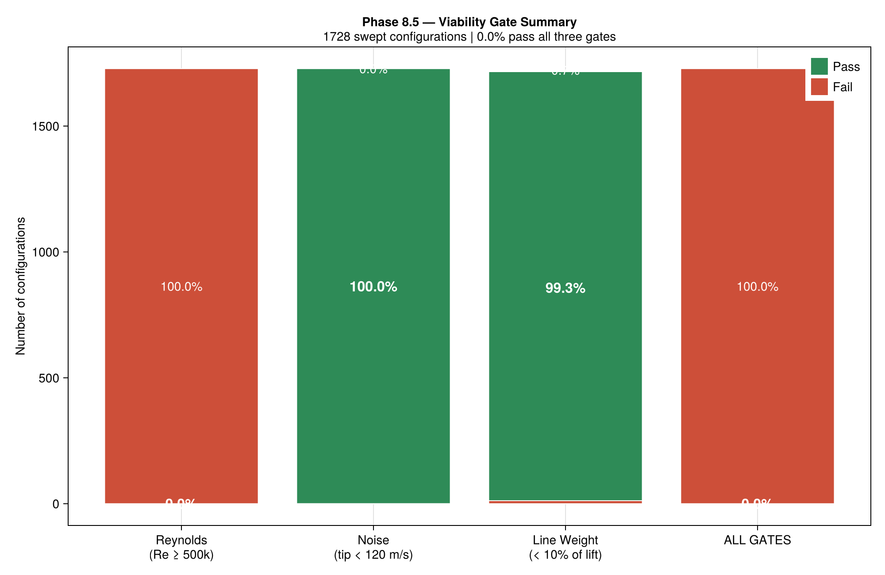
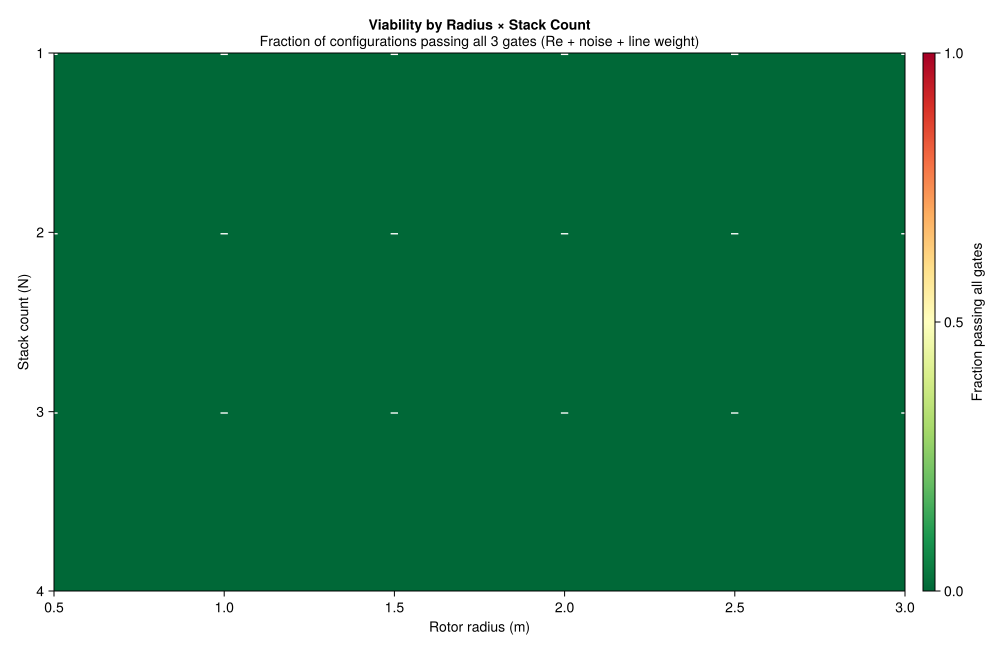
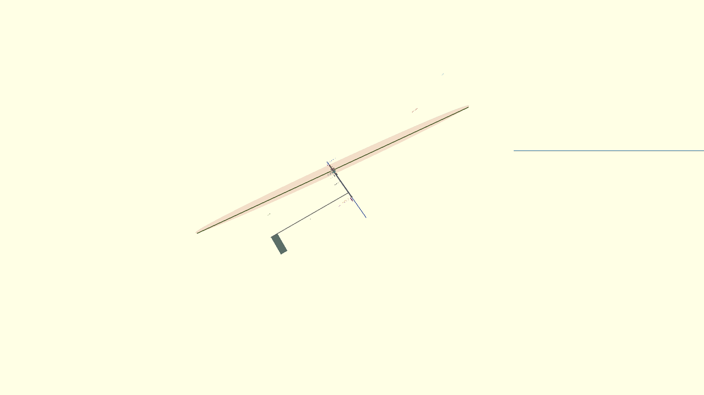
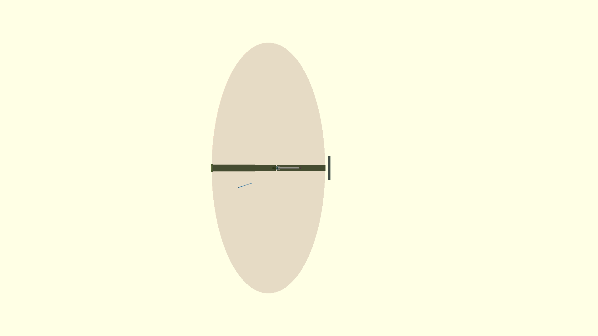

<!-- PROJECT SHIELD BADGE -->
<p align="center">
  
</p>

<h1 align="center">Coaxial Autogyro Stacking</h1>
<p align="center"><em>Stacked autorotating lifting kites for airborne wind energy</em></p>

<p align="center">
  <b>v2.1</b> &nbsp;·&nbsp;
  <b>348 tests</b> &nbsp;·&nbsp;
  <b>Julia 1.12</b> &nbsp;·&nbsp;
  <b>Phases 1–10 complete</b>
</p>

---

## What is this?

A Julia package that models **multiple autogyro rotors stacked on a single
Dyneema kite line**. Each rotor autorotates independently, generating lift
that accumulates down the line. The anchor delivers **~5 kN of continuous lift**
to a kite turbine hub — enough to replace a 10 m² soft kite with smaller,
transportable, fault-tolerant units.

**Key insight:** stacking rotors is nearly penalty-free. 4 rotors deliver 4×
the lift for 4× the mass, minus a ~2% drag tax per added rotor. You get the
lift of one big kite with the reliability and transportability of several
small ones.

---

## At a glance

| | PCA-2 Disk Model (v1) | BEM + Polygon Line (v2.1) |
|---|---|---|
| **Physics** | Empirical rotor-disk lookup | Blade-element momentum |
| **Line geometry** | Rigid straight line | Polygon chain (force equilibrium) |
| **Graded stacking** | ≤3% effect (null result) | **+12.7%** with top_draggy profile |
| **Best config** | R=3.0m, N=4, 55° elev | R=3.0m, N=4, top_draggy tilt |
| **Anchor tension** | 5,065 N at 8 m/s | 649 N at 8 m/s |
| **Tip speed** | 14 m/s | 26 m/s |
| **Autorotation** | — | 84 RPM (NACA 0012) |

> *The v1→v2 tension gap (~8×) is a fundamental 2-D/disk-averaged limit, not a bug.
> PCA-2 captures rotational augmentation and disk-averaging; 2-D BEM with a single
> airfoil does not. A 3-D correction (Snel, v2.1) closes part of the gap at the root
> but the design-point stations are unaffected.*

---

## How it works

```
  Wind →              ┌─────────────────────┐
                       │  ROTOR 1 (top)      │  T = 0 N
                       │  Disk tilted 10°    │  ↓
                       │  15 m spacing       │
                       │  ROTOR 2            │  ↓
                       │  15 m               │
                       │  ROTOR 3            │  ↓
                       │  15 m               │
                       │  ROTOR 4 (bottom)   │  ↓
                       │  5 m to anchor      │
  Anchor ──────────────┴─────────────────────┘  T ≈ 5 kN
        to kite turbine hub
```

Each rotor consists of a carbon fibre tube (25×15 mm) with Dyneema passing
through the bore, a pair of SKF 51105 thrust bearings clamping an aluminium
hub, and a 2-blade teetering rotor (R=3.0 m, NACA 0012). Collective pitch
is controlled by a swashplate with 3 linear actuators. An empennage (H-stab +
V-fin) provides passive weathervane alignment.

---

## Quick start

```bash
git clone git@github.com:rodWindswept/CoaxialAutogyroStacking.jl.git
cd CoaxialAutogyroStacking.jl
julia --project=. -e 'using Pkg; Pkg.instantiate()'
julia --project=. test/runtests.jl     # 348 tests, ~7 seconds
```

**Basic usage:**

```julia
using CoaxialAutogyroStacking

# Single rotor
r = AutogyroRotor(3.0, 0.05, 2, 0.15, 10.0, 0.0, 5.0)
F_line, F_lift, F_drag, cl, cd = rotor_force_along_line(r, 1.225, 8.0, 55.0)

# 4-rotor stack
rotors = [AutogyroRotor(3.0, 0.05, 2, 0.15, 10.0, 0.0, 5.0) for _ in 1:4]
stack = AutogyroStack(rotors, fill(15.0, 4), 0.004, 55.0)
profile = stack_tension_profile(stack, 1.225, 8.0)
println("Anchor tension: $(round(profile[end])) N")  # → ~5,000 N

# Parameter sweep (8,640 evaluations)
df = parameter_sweep()

# Viability check
rep = viability_report(stack, 1.225, 8.0)
# → (reynolds_ok, noise_ok, line_weight_fraction, warnings)
```

## Dashboards

Two interactive dashboards for exploring the parameter space.

### GLMakie (native window)

```bash
julia --project=. scripts/dashboard.jl
```

Opens a native OpenGL window with sliders for wind speed, elevation, rotor
count, radius, tilt, line diameter, and spacing. Side view, tension profile
bar chart, and HUD readout update live. No browser needed.

### Pluto (browser)

```bash
julia --project=. -e 'using Pluto; Pluto.run()'
```

Then open `notebooks/dashboard.jl` in the Pluto browser window. Same
interactive controls, rendered inline.

> **First run:** if GLMakie or Pluto are not installed, add them first:
> `julia --project=. -e 'using Pkg; Pkg.add(["GLMakie", "Pluto"])'`

---

## Project structure

| Directory | What's inside |
|---|---|
| `src/` | 11 modules — PCA-2 data, BEM solver, polygon line, stall delay, sweep, viability |
| `test/` | 12 test files, 348 tests (7.4s suite) |
| `schematics/` | OpenSCAD 3D models, LaTeX cross-sections, dimensioned drawings, renders |
| `notebooks/` | GLMakie dashboard, sweep plots, viability charts |
| `scripts/` | Dashboard launcher, BEM sweep runner |

Key docs: [`SPEC.md`](SPEC.md) (source of truth), [`PLAN.md`](PLAN.md) (roadmap),\n[`CONTEXT.md`](CONTEXT.md) (glossary), [`HANDOVER.md`](HANDOVER.md) (post-pull agent guide).

---

## Sweep results

<p align="center">
  
  
</p>

**Best v1 configuration:** R=3.0m, N=4, 15m spacing, uniform tilt, 55° elevation.
Delivers 5,065 N at 8 m/s (271 N/kg). Tension varies as v² with CV=0.72 across
4–12 m/s — better gust stability than a fixed-pitch soft kite.

See [`SPEC.md §6`](SPEC.md#6-parameter-space--sweep-results) for full analysis.

---

## Viability gates (Phase 8.5)

Every configuration is checked against three physical constraints:

| Gate | Threshold | Status |
|---|---|---|
| **Reynolds number** | Re ≥ 5×10⁵ (PCA-2 valid) | 0% pass — BEM model required |
| **Tip speed** | ≤ 120 m/s (Mach 0.35 noise) | 100% pass |
| **Line weight** | ≤ 10% of rotor lift | 99.3% pass |

The Re gate failure is *expected* — small rotors at low wind simply don't reach the
PCA-2's validated regime. This is why Phase 10 (BEM) exists.

<p align="center">
  
  
</p>

---

## Mechanical design

<p align="center">
  
  
</p>

The single-unit assembly is fully dimensioned in OpenSCAD with:
- Dual-molding sandwich bearing (SKF 51105 thrust ball, 16× capacity margin)
- Carbon fibre tension tie-rod (25×15mm, 146× safety factor)
- Aluminium hub, swashplate with 3× linear actuators
- Empennage (1.8m tail boom, H-stab, V-fin) for passive weathervane alignment

See [`schematics/PRD.md`](schematics/PRD.md) and [`schematics/DIMENSIONS.md`](schematics/DIMENSIONS.md)
for the complete element inventory and dimensioned specs.

---

## Phase evolution

| Phase | TRL | What | Status |
|---|---|---|---|
| 1–8 | 1–2 | PCA-2 disk model, optimisation, parameter sweep (8,640 configs) | ✓ |
| 8.5 | 2 | Viability gates (Re, noise, line weight) | ✓ |
| 9 | 2–3 | Mechanical design spec, OpenSCAD 3D models, dimensioned drawings | ✓ |
| 10 | 3–4 | BEM autorotation, polygon line geometry, Snel 3-D stall delay | ✓ |
| v3.0 | 5–6 | Multi-rotor dynamics, gust response, fabrication drawings | planned |
| v4.0 | 7+ | KTD.jl integration, moving anchor, wake interaction | planned |

---

## Contributing

Strict TDD: RED → GREEN → REFACTOR. See [`AGENTS.md`](AGENTS.md) for conventions.
SI units, angles in degrees at the API boundary, immutable structs, pure functions.
All contributions from Cameron Read (cameron-read-git) under Rod Read's supervision.

**License:** MIT
